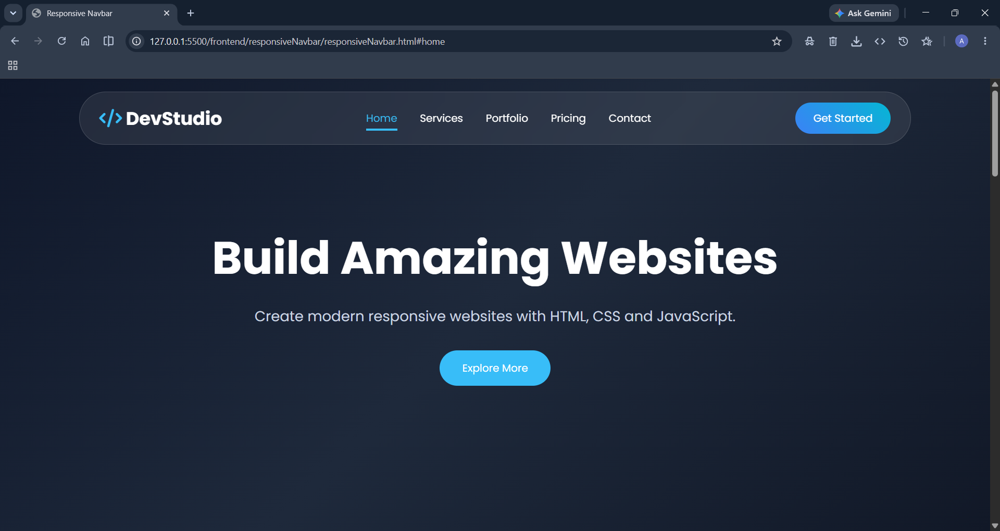
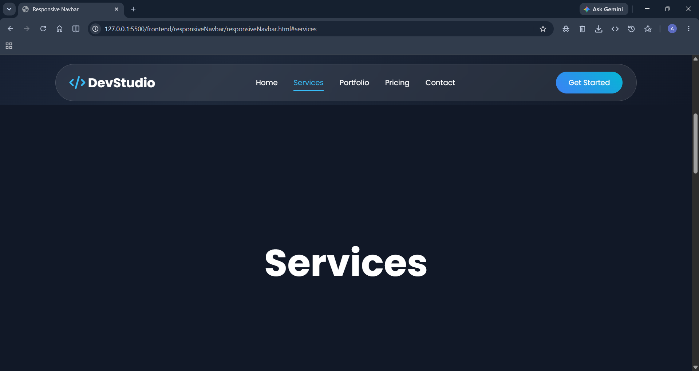
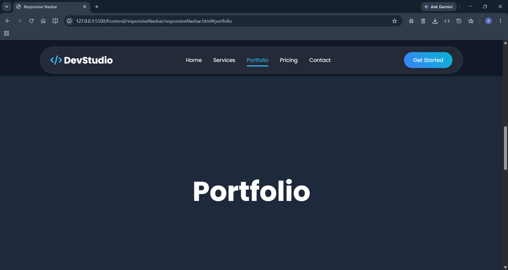
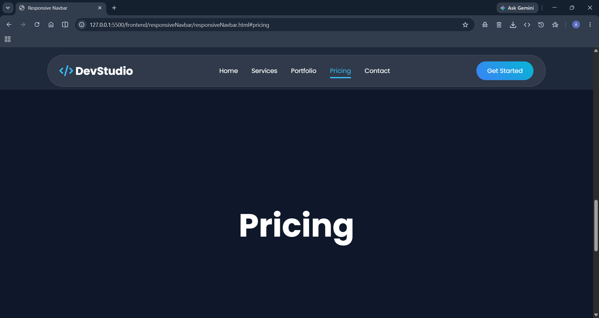
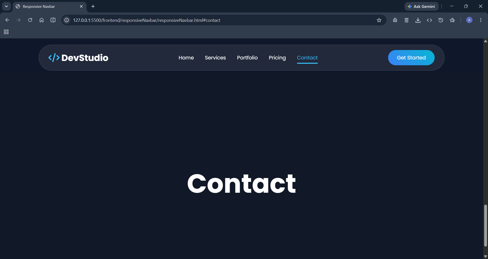

# ResNav
Responsive Navbar.
# 🚀 Responsive Navbar

A modern, responsive, and mobile-friendly navigation bar built using HTML, CSS, and JavaScript. The navbar automatically adapts to different screen sizes and provides a smooth user experience on desktops, tablets, and mobile devices.

---
## 📸 Preview

### Desktop View

## 🎥 Demo Video
> Click the image below to watch the demo.
> []
>
> ---

## ✨ Features

- 📱 Fully Responsive Design
- 🍔 Mobile Hamburger Menu
- 🎨 Modern UI Design
- ⚡ Smooth Animations
- 🔥 Lightweight
- 🌙 Easy to Customize
- 💻 Cross Browser Compatible
- 📐 Clean Code Structure

---

---

## 🛠️ Built With

- HTML5
- CSS3
- JavaScript (ES6)

---
---

## 👨‍💻 Author

**Ajay Kumar**

- GitHub: https://github.com/ajay0450586-coder
---

## ❤️ Thank You
